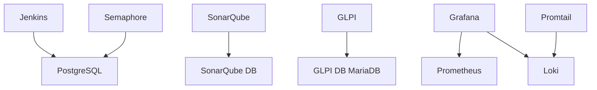

# Docker Services Documentation

## Overview

This document describes the Docker Compose services available in the infrastructure, including newly added services for Semaphore, GLPI, and Wildfly.

## Services Architecture

```
CI/CD Infrastructure
├── Jenkins (Port 8080) - CI/CD Automation
├── Semaphore (Port 3001) - Ansible UI
├── GitLab Runner - CI/CD Runner
│
Artifact & Code Quality
├── Nexus (Port 8081, 8082) - Artifact Repository
├── SonarQube (Port 9000) - Code Quality
│
Application Servers
├── Wildfly (Port 8090, 9990) - Java Application Server
│
Monitoring & Logging
├── Grafana (Port 3000) - Dashboards
├── Prometheus (Port 9090) - Metrics
├── Loki (Port 3100) - Log Aggregation
├── Promtail - Log Shipper
│
Inventory & Management
├── GLPI (Port 8888) - IT Asset Management
│
Security & Secrets
├── Vault (Port 8200) - Secrets Management
│
Databases
├── PostgreSQL (Port 5432) - Shared Database
├── Redis (Port 6379) - Cache
├── MariaDB (GLPI Database)
│
Infrastructure
├── Nginx (Port 80, 443) - Reverse Proxy
├── Mailhog (Port 8025) - Email Testing
```

## Deployment

### Starting All Services

```bash
cd docker
docker-compose up -d
```

### Starting Specific Services

```bash
# Start only monitoring stack
docker-compose up -d grafana prometheus loki

# Start only CI/CD stack
docker-compose up -d jenkins semaphore nexus

# Start only application stack
docker-compose up -d wildfly glpi
```

### Checking Service Status

```bash
# View all running containers
docker-compose ps

# View logs for all services
docker-compose logs -f

# View logs for specific service
docker-compose logs -f semaphore
```

## Service Details

### 1. Semaphore - Ansible UI (NEW)

**Purpose:** Web-based UI for managing and executing Ansible playbooks

**Access:**
- URL: http://localhost:3001
- Default User: admin
- Default Password: admin

**Features:**
- Visual playbook execution
- Inventory management
- Task scheduling
- Execution history
- Real-time output streaming
- Secure credential storage

**Configuration:**
```yaml
environment:
  - SEMAPHORE_DB_DIALECT=postgres
  - SEMAPHORE_ADMIN=admin
  - SEMAPHORE_ADMIN_PASSWORD=admin
  - SEMAPHORE_ACCESS_KEY_ENCRYPTION=gs72mfDGGwvZ4Am9t6vKEuRYmB98qS3z
```

**Volumes:**
- `/etc/semaphore` - Configuration
- `/ansible` - Ansible playbooks (read-only)
- `/ansible-blueprints` - Blueprint playbooks (read-only)

**Usage:**
1. Access http://localhost:3001
2. Login with admin credentials
3. Create a project
4. Add inventory from `/ansible/inventories/`
5. Add playbooks from `/ansible-blueprints/`
6. Execute tasks

**Screenshots:** `docs/screenshots/semaphore/`

### 2. GLPI - IT Asset Management (NEW)

**Purpose:** IT asset management and inventory system with FusionInventory

**Access:**
- URL: http://localhost:8888
- Initial Setup Required

**Features:**
- Asset inventory management
- Hardware and software tracking
- GLPI agent integration
- Ticket management
- Knowledge base
- Reports and dashboards

**Database Configuration:**
```yaml
glpi-db:
  - MYSQL_DATABASE=glpi
  - MYSQL_USER=glpi
  - MYSQL_PASSWORD=glpi
```

**Volumes:**
- `/var/www/html/glpi` - GLPI application data

**Initial Setup:**
1. Access http://localhost:8888
2. Follow installation wizard
3. Database setup:
   - Host: glpi-db
   - Database: glpi
   - User: glpi
   - Password: glpi
4. Configure FusionInventory plugin
5. Set up agent collection URL

**Integration:**
- GLPI agents configured via Ansible playbook
- Inventory collection from managed hosts
- Integration with Grafana for reporting

**Screenshots:** `docs/screenshots/glpi/`

### 3. Wildfly - Java Application Server (NEW)

**Purpose:** Java EE application server for deploying WAR/EAR applications

**Access:**
- Application: http://localhost:8090
- Management Console: http://localhost:9990
- Default User: admin
- Default Password: admin

**Features:**
- Java EE 8 support
- Management console
- Deployment scanner
- Clustering support
- JMX monitoring
- Hot deployment

**Configuration:**
```yaml
environment:
  - WILDFLY_USER=admin
  - WILDFLY_PASS=admin
command: /opt/jboss/wildfly/bin/standalone.sh -b 0.0.0.0 -bmanagement 0.0.0.0
```

**Volumes:**
- `/opt/jboss/wildfly/standalone/deployments` - Application deployments
- `/opt/jboss/wildfly/standalone/log` - Server logs

**Deployment Methods:**

1. **File Copy Deployment:**
```bash
# Copy WAR file to deployment directory
docker cp application.war wildfly:/opt/jboss/wildfly/standalone/deployments/
```

2. **CLI Deployment:**
```bash
# Using Wildfly CLI
docker exec -it wildfly /opt/jboss/wildfly/bin/jboss-cli.sh --connect
deploy /path/to/application.war
```

3. **Jenkins Pipeline:**
Use `Jenkinsfile-wildfly-deployment` for automated deployment

**Monitoring:**
- JMX metrics exposed to Prometheus
- Logs aggregated in Loki
- Grafana dashboards for visualization

**Screenshots:** `docs/screenshots/docker/wildfly/`

### 4. Jenkins - CI/CD Server

**Access:**
- URL: http://localhost:8080
- Configuration: Auto-configured

**New Pipelines:**
- `Jenkinsfile-rsyslog-validation`
- `Jenkinsfile-logrotate-validation`
- `Jenkinsfile-wildfly-deployment`

**Volume Mounts:**
- `/var/jenkins_home` - Jenkins home directory
- `/var/run/docker.sock` - Docker socket for DinD

### 5. Grafana - Monitoring Dashboards

**Access:**
- URL: http://localhost:3000
- User: admin
- Password: admin

**New Dashboards:**
- Rsyslog monitoring
- Logrotate status
- GLPI inventory metrics
- Wildfly application metrics
- Zabbix integration metrics

**Data Sources:**
- Prometheus (metrics)
- Loki (logs)
- PostgreSQL (GLPI data)

### 6. Prometheus - Metrics Collection

**Access:**
- URL: http://localhost:9090

**New Targets:**
- Wildfly JMX exporter
- GLPI metrics
- Semaphore metrics

**Configuration:** `docker/prometheus/prometheus.yml`

### 7. Loki - Log Aggregation

**Access:**
- URL: http://localhost:3100

**Log Sources:**
- Rsyslog forwarding
- Docker container logs
- Wildfly server logs
- Semaphore logs

## Service Dependencies



## Environment Variables

Create a `.env` file in the `docker/` directory:

```bash
# Semaphore
SEMAPHORE_ACCESS_KEY=gs72mfDGGwvZ4Am9t6vKEuRYmB98qS3z

# Vault
VAULT_DEV_TOKEN=root-token

# Database passwords (change for production!)
POSTGRES_PASSWORD=admin
GLPI_DB_PASSWORD=glpi
SONAR_DB_PASSWORD=sonar

# Wildfly
WILDFLY_ADMIN_USER=admin
WILDFLY_ADMIN_PASSWORD=admin
```

## Volume Management

### Backup Volumes

```bash
# Backup all volumes
docker run --rm -v wildfly_data:/data -v $(pwd):/backup \
  alpine tar czf /backup/wildfly_data_backup.tar.gz -C /data .

# Backup GLPI data
docker run --rm -v glpi_data:/data -v $(pwd):/backup \
  alpine tar czf /backup/glpi_data_backup.tar.gz -C /data .

# Backup Semaphore config
docker run --rm -v semaphore_data:/data -v $(pwd):/backup \
  alpine tar czf /backup/semaphore_data_backup.tar.gz -C /data .
```

### Restore Volumes

```bash
# Restore wildfly data
docker run --rm -v wildfly_data:/data -v $(pwd):/backup \
  alpine tar xzf /backup/wildfly_data_backup.tar.gz -C /data
```

## Networking

All services are connected to the `cicd-network` bridge network:

```bash
# Inspect network
docker network inspect docker_cicd-network

# Test connectivity between services
docker exec semaphore ping glpi
docker exec wildfly ping prometheus
```

## Health Checks

```bash
# Check all services health
docker-compose ps

# Individual service health
curl http://localhost:3001/api/ping  # Semaphore
curl http://localhost:8888          # GLPI
curl http://localhost:8090          # Wildfly
curl http://localhost:3000/api/health # Grafana
```

## Maintenance

### Update Services

```bash
# Pull latest images
docker-compose pull

# Recreate services with new images
docker-compose up -d --force-recreate

# Update specific service
docker-compose pull semaphore
docker-compose up -d semaphore
```

### Clean Up

```bash
# Remove stopped containers
docker-compose down

# Remove volumes (CAUTION: data loss!)
docker-compose down -v

# Remove unused images
docker image prune -a
```

### View Resource Usage

```bash
# Resource usage for all containers
docker stats

# Disk usage
docker system df

# Volume sizes
docker system df -v
```

## Troubleshooting

### Service Won't Start

```bash
# Check logs
docker-compose logs <service-name>

# Check if port is already in use
netstat -tuln | grep <port>

# Restart specific service
docker-compose restart <service-name>
```

### Database Connection Issues

```bash
# Check database is running
docker-compose ps postgres glpi-db

# Test database connectivity
docker exec postgres psql -U admin -d cicd -c "\l"
docker exec glpi-db mysql -u glpi -pglpi -e "SHOW DATABASES;"
```

### Performance Issues

```bash
# Check resource limits
docker inspect <container-name> | grep -A 10 Resources

# Monitor resource usage
docker stats --no-stream

# Check disk space
df -h
docker system df
```

## Security Considerations

### Production Deployment

1. **Change default passwords** in all services
2. **Use external databases** for production
3. **Enable SSL/TLS** for all web interfaces
4. **Configure firewall rules** appropriately
5. **Use secrets management** (Vault)
6. **Enable authentication** on all services
7. **Regular backups** of volumes
8. **Monitor logs** for security events
9. **Keep images updated** regularly
10. **Use non-root users** in containers

### Secure Configuration

```yaml
# Example production overrides
# Create docker-compose.override.yml

services:
  semaphore:
    environment:
      - SEMAPHORE_ADMIN_PASSWORD=${SEMAPHORE_PASSWORD}
      - SEMAPHORE_ACCESS_KEY_ENCRYPTION=${SEMAPHORE_KEY}
  
  wildfly:
    environment:
      - WILDFLY_PASS=${WILDFLY_PASSWORD}
  
  glpi:
    environment:
      - GLPI_ADMIN_PASSWORD=${GLPI_PASSWORD}
```

## Integration Testing

```bash
# Test complete stack
./scripts/test-docker-stack.sh

# Verify all services are accessible
curl -f http://localhost:3001 || echo "Semaphore not ready"
curl -f http://localhost:8888 || echo "GLPI not ready"
curl -f http://localhost:8090 || echo "Wildfly not ready"
curl -f http://localhost:3000 || echo "Grafana not ready"
```

## Screenshots

Service screenshots are available in:
- `docs/screenshots/docker/semaphore/`
- `docs/screenshots/docker/glpi/`
- `docs/screenshots/docker/wildfly/`
- `docs/screenshots/docker/stack-overview/`

## Additional Resources

- [Semaphore Documentation](https://docs.semaphoreui.com/)
- [GLPI Documentation](https://glpi-project.org/documentation/)
- [Wildfly Documentation](https://docs.wildfly.org/)
- [Docker Compose Reference](https://docs.docker.com/compose/)
